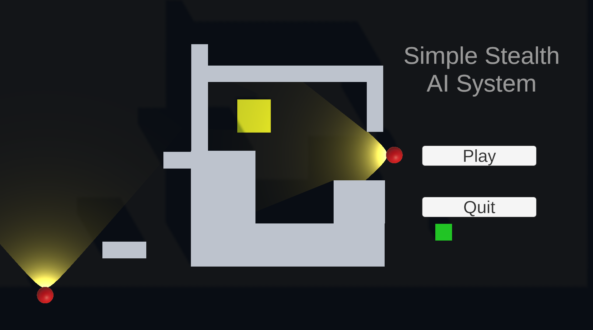
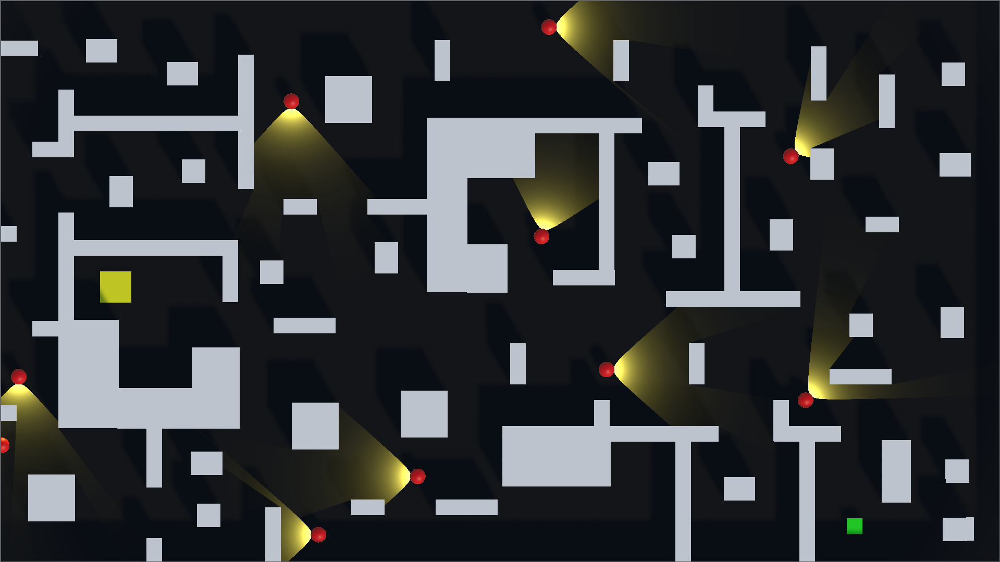
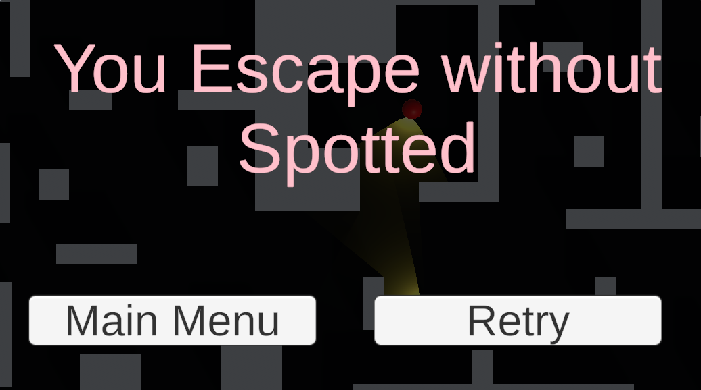
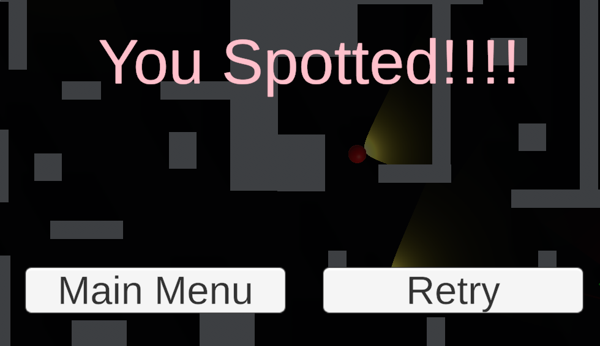

# Basic Stealth AI System

A <b>3D stealth AI prototype</b> developed in Unity featuring waypoint patrols, vision cone detection, line-of-sight checks, and event-driven gameplay systems.

> **Learning Project**  
> This project was created by following **Sebastian Lague's** Stealth Game tutorial series. It helped me understand AI programming concepts such as waypoint navigation, player detection, line-of-sight calculations, event-driven programming, and game state management in Unity.

---

# Overview

**Basic Stealth AI System** is a 3D stealth gameplay prototype developed in Unity to learn the fundamentals of enemy AI and stealth mechanics.

The project demonstrates patrol behaviors, player detection using vision cones and line-of-sight checks, and event-driven communication between gameplay systems. It provided valuable experience in structuring modular gameplay code and implementing AI behavior using Unity.

---

# Screenshots

    

    

    

    

---

# Features

-  Waypoint Patrol AI
-  Vision Cone Detection
-  Line-of-Sight Checking
-  Progressive Player Detection
-  Win & Lose Conditions
-  Event-Driven Gameplay
-  Responsive Player Controls
-  Clean UI & Menus

---

# Gameplay Systems

### Enemy AI

- Waypoint patrol system
- Vision cone detection
- Line-of-sight validation
- Player chasing
- Detection timer

### Player

- Third-person movement
- Stealth gameplay
- Goal-based progression

### Game Systems

- Event-driven architecture
- Win & lose states
- Level restart
- Game management

### User Interface

- Main Menu
- In-game UI
- Win Screen
- Game Over Screen

---

# Technologies Used

| Category | Technologies |
|----------|--------------|
| **Engine** | Unity 6 |
| **Language** | C# |
| **AI** | Unity Physics, Coroutines |
| **UI** | Unity UI, TextMeshPro |
| **Tools** | Visual Studio, Git |

---

# Controls

| Action | Key |
|--------|-----|
| Move | **W A S D** |

---

# What I Learned

- AI programming fundamentals
- Waypoint navigation
- Vision cone implementation
- Line-of-sight calculations
- Event-driven programming
- Gameplay state management
- Writing modular Unity scripts

---

# Future Improvements

- Multiple enemy types
- Patrol state machine
- Hearing system
- Suspicion meter
- Difficulty levels
- Smarter search behaviors

---

# My Contribution

This project was completed as part of my game development learning journey.

**Responsibilities**

- Understanding and implementing AI systems
- Learning Unity Physics-based detection
- Integrating gameplay systems
- UI implementation
- Testing & Debugging

---

# Acknowledgements

This project follows the excellent **Stealth Game** tutorial series created by **Sebastian Lague**.

The tutorial provided a strong foundation for learning AI programming, stealth mechanics, and gameplay architecture in Unity.

Special thanks to **Sebastian Lague** for creating high-quality educational content that has helped many aspiring game developers.

---

 If you found this project interesting, consider giving it a star!

